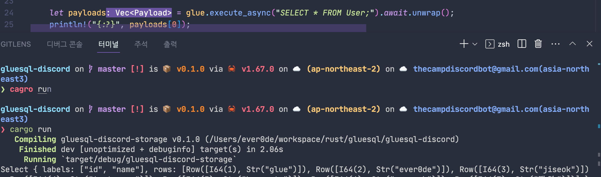

# [GlueSQL](https://github.com/gluesql/gluesql) Discord Storage

After discussing how CI testing will be managed, we plan to move it upstream.

## Precautions for use

- discord ToS

  - <https://discord.com/terms>
  - <https://discord.com/developers/docs/policies-and-agreements/developer-policy>
  - <https://discord.com/developers/docs/policies-and-agreements/developer-terms-of-service>

> You may not mine or scrape any data, content, or information available on or through Discord services (as defined in our Terms of Service).

- This project does not mine or scrape information from Discord. (This project stores all data on Discord.)
However, if you retrieve data using this project and save it separately or perform other actions, the above may cause problems.

## Result Images

- Example of reading discord messages into sql

